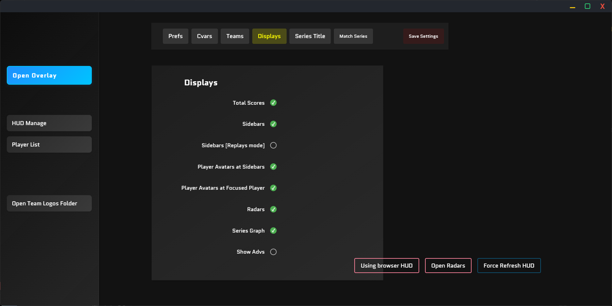

# EHM6 / CS2 Spectators Customs HUD [中文文档版本点这](./README_CN.md)

This project is built using Electron, Vue.js, Express.js, and other dependencies. It's a fork of [drweissbrot/cs-hud](https://github.com/drweissbrot/cs-hud) and has been independently developed and maintained by the author.

---

## Getting Started

### Basic Installation

1. Download the latest installer or ZIP file from the **Releases** page.
2. Run the installer or extract the ZIP file.
3. Launch the main application.
4. Download the configuration file `gamestate_integration_EHud.cfg` from the **Releases** page.
5. Place the configuration file in your game directory under `/game/csgo/cfg`.

### Using the Features

When you launch the application, a main window will appear:

* **Sidebar Features** :
* **Open Overlay** : This button maps the HUD to your display. Click it to show the HUD on your screen. To close it, click  **Close Overlay** .
* **HUD Manage** : This page lets you configure all HUD settings, including map information (Match Series), game data (Prefs, Cvars), and style settings (Displays, Series Title). Remember to click **Save Settings** after making changes.
* **Player list** : When you join a game in "observer" mode, all player information will be displayed here. You can modify player avatars, names, and toggle avatar loading (loadAvatar).
* **Open Team Logos Folder** : Click this button to quickly access the team logos folder. Place your team logos (must be `.png` format) here, and name the images after the team names (e.g., if a team is named "Eclipse HM," name the image "Eclipse HM.png").
* **Note** : If changes to the HUD don't take effect or issues arise, go to the **HUD Manage** page and click  **Force Refresh HUD** .

---

### Advanced Usage

#### Q: How do I map the HUD in OBS or vMix?

 **A: Method 1** :
In OBS or vMix, create a browser source and enter the following URL:
`http://127.0.0.1:31982/hud/index.html?transparent`
Set the width to 1920 and the height to 1080.

 **A: Method 2** :
In OBS or vMix, capture the "CS-HUD" window.

#### Q: Why isn't the HUD showing up in the game?

 **A** : Double-check steps 4 and 5 of the **Basic Installation** to ensure the configuration file is correctly placed.

#### Q: Why is the HUD lagging or experiencing delays?

 **A** : Try limiting your game's frame rate to below 120.

#### Q: What if I have other issues?

 **A** : Feel free to join our Discord community for help: [https://discord.gg/6YFnDQPNNn](https://discord.gg/6YFnDQPNNn)

---

### A Note from the Developer

This project is developed and maintained by a single person. If you're interested in contributing or helping out, please reach out via Discord! Your support is greatly appreciated.
