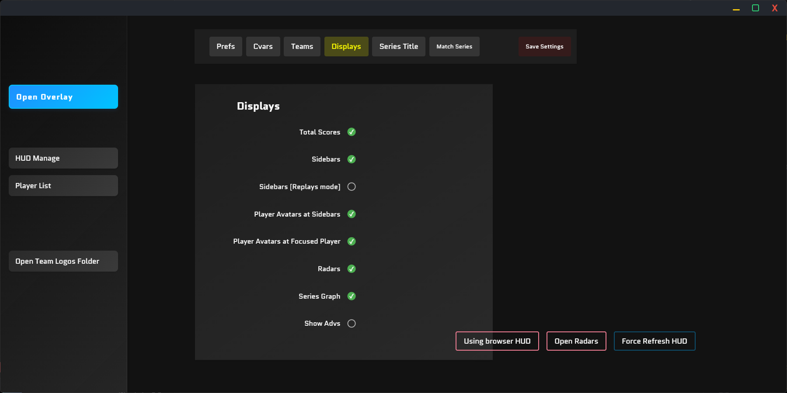

# EHM6 / CS2 Spectators Customs HUD

这是一个基于 Electron、Vue.js 和 Express.js 等技术构建的项目，基于 [drweissbrot/cs-hud](https://github.com/drweissbrot/cs-hud) 进行了二次开发。项目的开发和维护均由作者本人独立完成。

---

## 使用教程

### 基础安装

1. 在 **Releases** 页面下载最新版本的安装程序或压缩包。
2. 运行安装程序或解压压缩包。
3. 启动主程序。
4. 在 **Releases** 页面下载配置文件 `gamestate_integration_EHud.cfg`。
5. 将配置文件放置在游戏目录的 `/game/csgo/cfg` 文件夹中。

### 功能使用

启动程序后，您将看到一个主窗口：

* **侧边栏功能说明** ：
* **Open Overlay** ：将 HUD 映射到显示器中。点击后，HUD 将显示在屏幕上。若需关闭，请点击  **Close Overlay** 。
* **HUD Manage** ：在此页面配置 HUD 的所有信息，包括地图信息（Match Series）、游戏数据（Prefs、Cvars）以及样式设置（Displays、Series Title）。修改后请务必点击 **Save Settings** 按钮。
* **Player list** ：当您以“观察者”模式进入游戏时，所有玩家的信息将显示在面板中。您可以修改玩家的头像、名称，以及是否加载头像（loadAvatar）。
* **Open Team Logos Folder** ：点击此按钮可快速打开队伍图标文件夹。将队伍图标（必须为 `.png` 格式）放置在此文件夹中，并将图片名称改为队伍名称（例如，若队伍名称为 "Eclipse HM"，则图片名称应为 "Eclipse HM.png"）。
* **注意事项** ：如果修改 HUD 后未生效或出现其他问题，请前往 **HUD Manage** 页面并点击右下角的 **Force Refresh HUD** 按钮。

---

### 进阶教程

#### Q: 如何在 OBS 或 vMix 中映射 HUD？

 **A: 方法一** ：
在 OBS 或 vMix 中创建一个浏览器源，输入以下地址：
`http://127.0.0.1:31982/hud/index.html?transparent`
设置宽度为 1920，高度为 1080。

 **A: 方法二** ：
在 OBS 或 vMix 中捕获程序窗口 "CS-HUD"。

#### Q: 为何在游戏中无法显示 HUD？

 **A** : 请重新检查 **基础安装** 的第四步和第五步，确保配置文件放置正确。

#### Q: HUD 出现卡顿、延迟或其他问题？

 **A** : 尝试将游戏帧率限制在 120 以下。

#### Q: 其他问题？

 **A** : 欢迎加入项目的 Discord 社区获取帮助：[https://discord.gg/6YFnDQPNNn](https://discord.gg/6YFnDQPNNn)

---

### 特别说明

由于项目开发人手有限，我们希望有志之士能够加入并提供帮助！如果您有兴趣，请通过 Discord 联系我们。

---

希望这个版本更符合您的需求！如果需要进一步调整，请随时告诉我。
